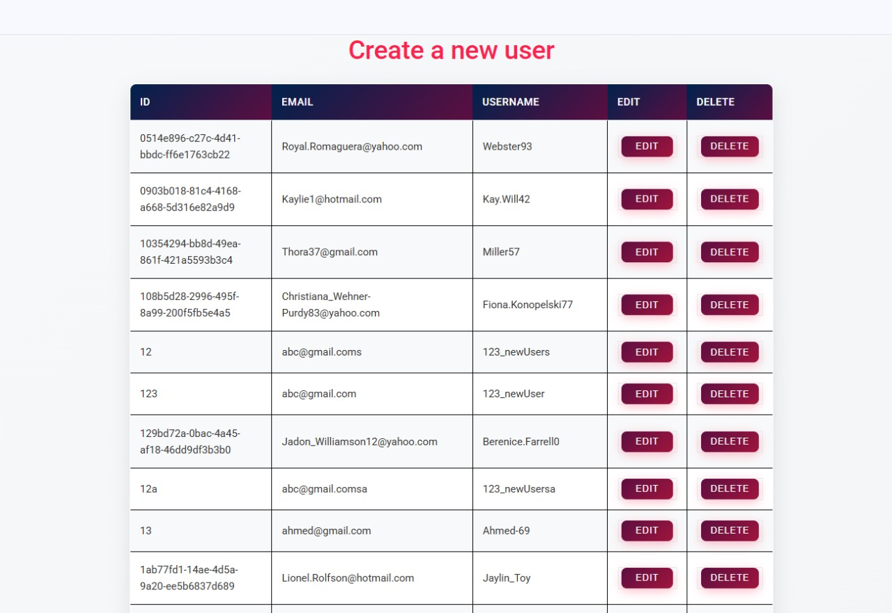
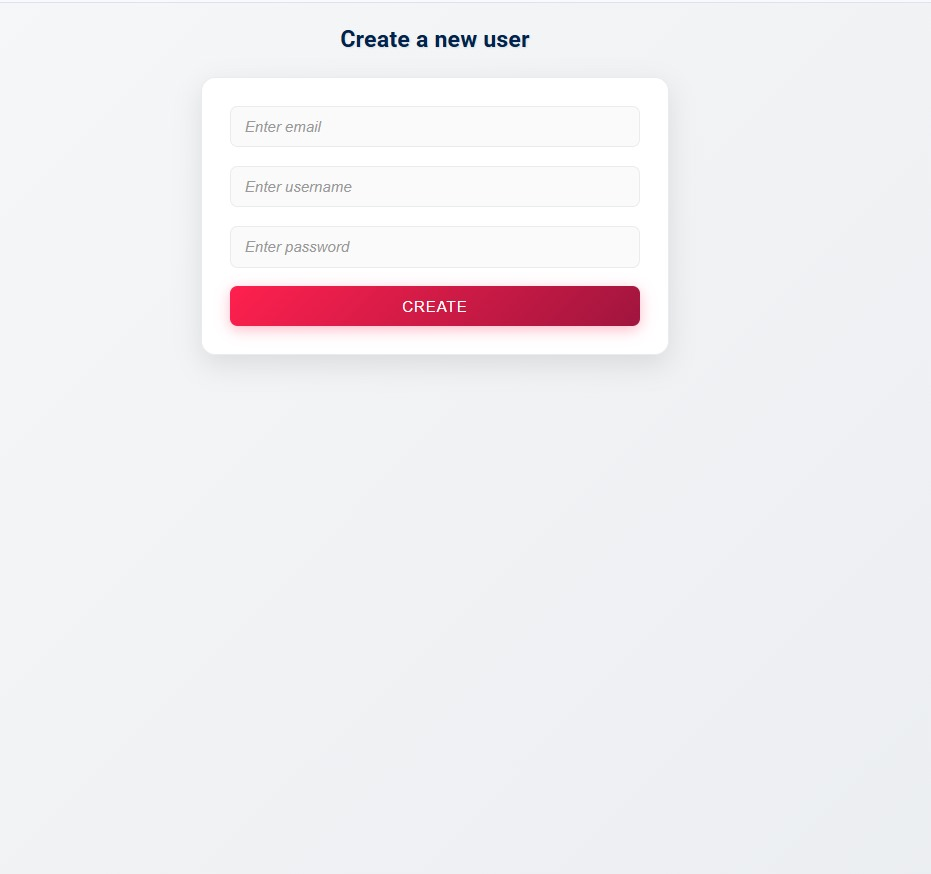
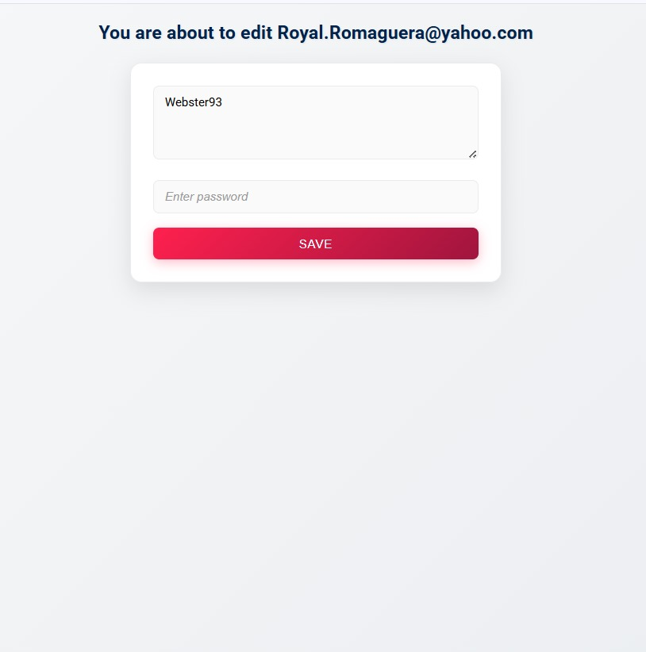

# User Management App (Node.js + Express + MySQL)

A full-stack CRUD application built with **Node.js**, **Express**, **MySQL**, and **EJS** templates.

## Screenshots

### Home Page


### Add User Page


### Edit User Page


## Features
- Create, read, update, and delete users
- Password verification before editing
- Professional responsive UI using a custom CSS theme (colors: `#FF204E`, `#A0153E`, `#5D0E41`, `#00224D`)
- Mobile-friendly tables and forms
- Clean, simple codebase for learning purposes

## Tech Stack
- **Backend:** Node.js, Express.js, MySQL2
- **Frontend:** EJS templates, CSS
- **Other:** Method Override, Faker.js

## Installation
```bash
git clone https://github.com/yourusername/user-management-app.git
cd user-management-app
npm install
node index.js
